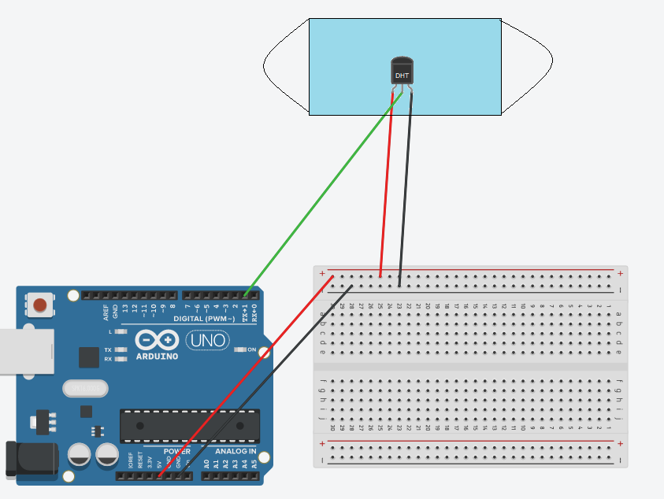

# Game concept
The idea for my game is diving. In this game player controlls the breathing of the character by their own breath. The main gameplay mechanic is that when player hold it's breath the character does the same thing. The goal is to escape the underwater cave. Player will have some areas where they can get some fresh air and then continiue towards the exit.

# Components
In order to make this mechanic to work I will use facemask which is nowadays is a constant part of our everyday life and DHT22 temprature and humidity detector. Those are the main components for the breath control. By detecting the difference between the temprature and humidity game will detect if the player is breathing and then, if the game character is underwater, it will damage the player.

