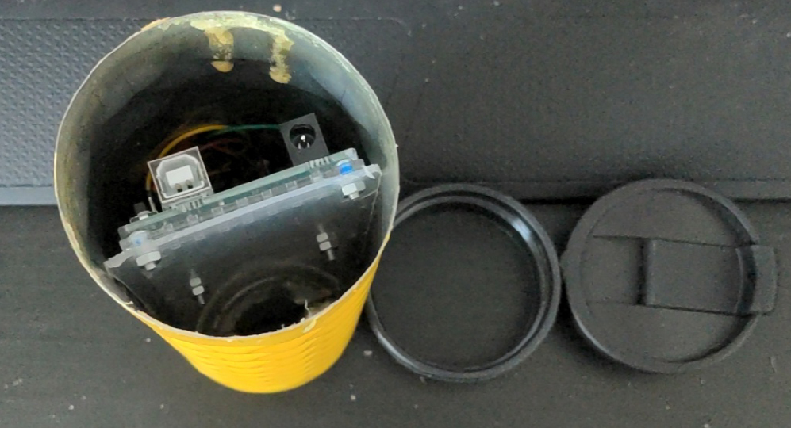
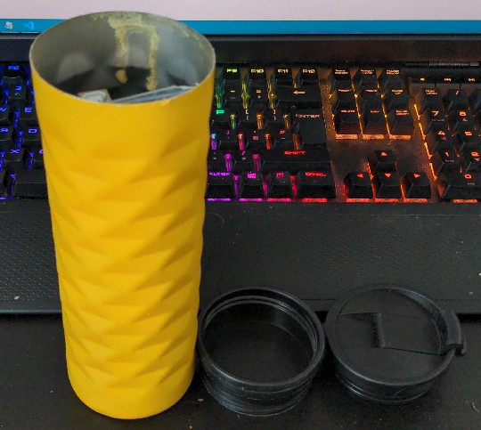

# COMP140 Project Proposal
----------
### Game Design
The game and controller I am setting out to make revolve around the usage of an old flask to act as a cocktail mixer. The game revolves around players taking orders from customers and making their cocktails. The player will have a set amount of time to take the order and serve it, the quicker they are, the bigger the tip they get is.

### Concept
The intital concept started with the fact I have an old, spare flask which is broken. With this, I felt I could use an Accelerometer and Gyroscope to check the orientation of the flask, along with if its being shaken.

